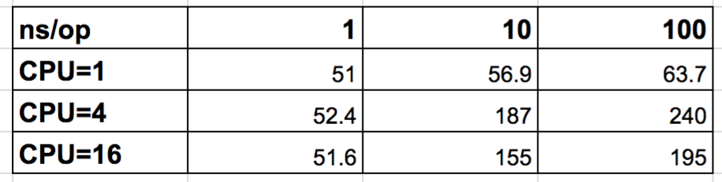
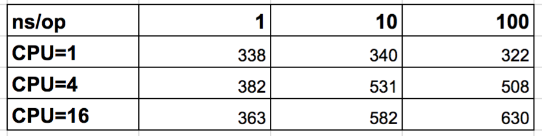
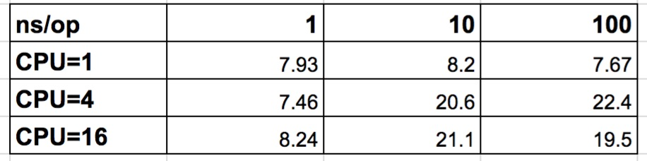

## Memory Sharing

by Michael Pöllath

---
### About me

---

### What inspired this?

Check out the Go-Talk from Bjorn Rabenstein:
https://www.youtube.com/watch?v=1V7eJ0jN8-E

---
### Problem Statement

1. We want to increase a gobal value by a positiv amount.
2. It needs to be goroutine safe.

---?code=talk1/sample/interface/interface.go&lang=golang&title=Interface
---?code=talk1/sample/naive/naive_approach.go&lang=golang&title=Naive implementation
---?code=talk1/sample/naive/bench.go&lang=golang&title=Benchmark

--- 
### How to Benchmark

go test -bench=Counter -cpu=1,4,16
---

---

---

---

---
### What is bad about this ?
1. It is not goroutine safe. 

